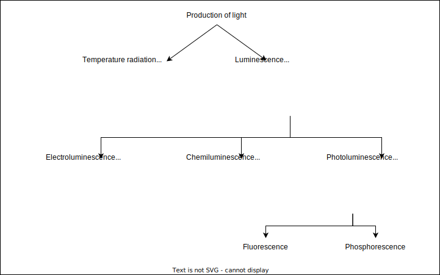

## What is Spectroscopy?

Spectroscopy is the branch of physics that serves as macroscopic as well as microscopic investigation tool for understanding physical as well as chemical phenomena. It deals with the observation and interpretation of radiation emitted and absorbed by atoms amd molecules, and throws light on their structure.

## Investigation of spectra

method used for seperation of light components for study

materials used for study at different wavelengths.

## Production of spectra

*Absorption spectra* is produced in atoms when they absorb photons of specific frequencies that match the energy gap between their ground state and their excited state. When an atom absorbs a photon, one of its electrons jumps to a higher energy level. The absorbed frequencies appear as dark lines or gaps in the spectrum when the transmitted light is analyzed.

*Emission spectra* is produced in atoms when they release photons of specific frequencies that match the energy gap between their excited state and their ground state. When an atom releases a photon, one of its electrons falls to a lower energy level. The emitted frequencies appear as colored lines in the spectrum when the emitted light is analyzed.

## Wavenumber

wavenumber($\bar{v}$) represents the number of waves per unit length, thus wavenumber can be calculated without using the velocity of light $c$ and wavenumber is used for measurement purposes in spectroscopy. But it is not an absolute constant and depends upon the refractive index of the medium. Wavenumber energy equivalent can be deducted from Planck's radiation law,
$$ \Delta{E} = hv = \frac{ch}{\lambda} = ch\bar{v}$$

The generalised equation for spectrum is
$$ \bar{v} = R
\begin{pmatrix}
\frac{1}{n^2_1} - \frac{1}{n^2_2}
\end{pmatrix}
$$
where $R = 1.097 \times 10^7 m^{-1}$, Rydberg constant and $n = 1, 2, 3,.....$ and $n_1 < n_2$

## Ritz-combination rule

The rule states that the spectral lines of any element include frequencies that are either the sum or the difference of the frequencies of two other lines. Since the total energy will be same for the transition irrespective of the states in between transition, the frequency of the all line of similar transitions will be equal.

Let's say the transition is $n_3 \to n_1$. It can happen two ways. Either in two steps via $n_3 \to n_2$ and then $n_2 \to n_1$, or in one step $n_3 \to n_1$. Then the sum of the frequency of both the transitions will be same, because the total energy is same, so

$$ \bar{v}\_{n\_3 \to n\_2} + \bar{v}\_{n\_2 \to n\_1} = \bar{v}\_{n\_3 \to n\_1} $$
