### Contents

1. Electromagnetic Spectrum
2. Types of molecular energies
3. Different Spectroscopic Methods
4. Spectral line width
5. Absoption and Emission of Radiation

## Electromagnetic Spectrum

Energy of electromagnetic radiation is given by, $$\boxed {E = hv = \frac{hc}{λ}}$$ where $v$ is the frequency, $λ$ is the wavelength and $h$ is planck's constant $(=6.626 \times 10^{-34} Js)$

Wavenumber $(\bar{v})$ is given by, $$\boxed {\bar{v} = \frac{v}{c} = \frac{1}{λ}}$$ and it is expressed in $cm^{-1}$ or $m^{-1}$.

$cm^{-1} = 100 \ m^{-1}$

## Types of molecular energies

Molecules (gas and liquid phase) possess different types of energies:

1. **Translational Energy** $(E_t)$ due to translational motion of the molecules.
2. **Electronic Energy** $(E_e)$ since the electrons associated with each atom or bond are in continous motion.
3. **Vibrational Energy** $(E_v)$ due to periodic displacement of its atom from their equilibrium position.
4. **Rotational Energy** $(E_r)$ by virtue of bodily rotation about its centre of gravity.

Apart from Translational Energy all other Energies are having quantum restrictions in their energy level. This is due to restoring forces of bonds and the space available for translational motion is large as the volume is large. According to Born and Oppenheimer, the various forms of energy of molecules are independent of each other.

## Different Spectroscopic Methods

Radiation upon interacting with matter undergo changes in the frequency, direction, phase or polarization. Depend upon the different frequencies of the radiation, the different types of interaction can happen.

And some other phenomena also possible for radiation with frequency $v_0$ when interacts with matter and giving radiation of frequency.

1. Flourescenece $(v < v_0)$
2. Phosphorescence $(v < v_0)$
3. Rayleigh Scattering $(v = v_0)$
4. Raman Scattering $(v = v_0 \pm v_m)$

## Spectral line width

Spectral lines are lines in a spectrum that show the presence or absence of photons of a specific frequency, resulting from emission or absorption of light by a quantum system, usually atoms or molecules. Spectral lines are result of interaction of a quantum system with a photon. If the photon has enough energy for a change in the energy state, then the interaction will happen and spectral lines are produced. The frequency of the absorbed or emitted photon corresponds to  a spectral line.

Theoretically we expect zero spectral line width because of the discrete energy level it will only produce, but due to uncertainity in energy levels and some other factors, the spectral lines tends to broader and is not zero. So the line will have finite width as rather than a theoretical zero width.

The important factors that contribute to the broadening are natural line width, collision broadening, Doppler Broadening, etc.

### Natural line width

This anomality is arise due to the implication of the uncertainity principle. We know that the energy difference and time taken for the transition are unable to precisily determine beyond a particular value simultaneously. The uncertainity is given by $ΔEΔt = \frac{\hbar}{2}$. Since $ΔE$ is the energy difference between the states, it will be the line width and $Δt$ is the half-life.

$
\text{ground state} \to \text{high Δt} \to \text{low line width} \newline
\text{exicted state} \to \text{low Δt} \to \text{high line width}
$

### Collision or pressure broadening

The molecules or atoms collides with each other and the their energy levels also undergo change due to this collision which results in varied emission and abosrption of photon, thus broadening the spectral line width. Since collision rate is depend upon pressure too, it is also known as pressure broadening.

### Doppler broadening

Due to doppler effect on the frequency of the emission and absorption, the line width broaden. This broadening is called Doppler broadening. The Doppler shifted absorption frequency is given by $v = v_0(1 \pm \frac{ν}{c})$, where $\pm$ sign relates to motion of the molecule towards or away the exicting radiation source, $v_0$ is the absorption frequency of the stationary atom and $ν$ is the component of molecular velocity along the light propogation direction.

## Absoption and Emission of Radiation

The molecules and atoms have different energy levels and the energy state of the atoms and molecules change via Absorption, Spontaneous Emission, Stimulated Emission.

### Absorption

$\text{atom} + \text{photon} \to \text{atom}^*$

### Spontaneous Emission

$\text{atom}^* \to  \text{photon} + \text{atom}$

### Stimulated Emission

$\text{atom}^* \to 2 \ \text{photon} + \text{atom}$