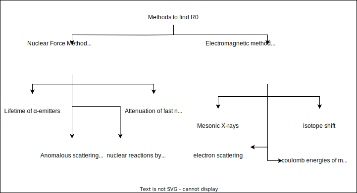

### Introduction

* The strong nuclear force is responsible for holding the nucleus together.
* Stable nuclei do not decay by the strong interaction. They may transform by beta and alpha emission (weak or electromagnetic) with long lifetimes.
* The binding energy is the energy required to split a nucleus into its constituents. It gives information on forces between nucleons, stability of the nucleus, and energy released or required in nuclear decays or reactions.
* The atomic nucleus is composed of protons and neutrons. Protons carry one unit of positive charge (+e) and neutrons carry no charge. These particles are packed together into an extremely small space at the center of an atom.
* The number of protons in the nucleus is given by the atomic number, Z. The number of neutrons in the nucleus is the neutron number, N. The total number of nucleons is the mass number, A. These numbers are related by A = Z + N

### Basic Nuclear Properties

1. [Size](#size)
2. [Binding Energy](#binding-energy)
3. [Angular Momentum](#angular-momentum)
4. [Parity](#parity)
5. [Magnetic Moment](#magnetic-moment)

## Size

size of an atom = $10^{-10}m$

size of a nucleus = $10^{-15}m$

It is evident from the α-particle scattering by Rutherford, that the nucleus is composed of protons and neutrons only. There is an experimental evidence that nuclear density ρ remains approximately constant over most of the nucleus volume and then decreases rapidly to  zero.

So, nuclear volume is approximately proportional to the number of nucleons *i.e.,* mass number $A$.

$$
V = \frac{4}{3}πR^3 \\\\
\implies \frac{4}{3}πR^3 \propto A \\\\
\implies R \propto A^\frac{1}{3} \\\\
\implies R = R_0A^\frac{1}{3}
$$
where $R_0$ is the nuclear unit radius and $R$ is the nuclear radius.

Thus we need to find the $R_0$ to get the nuclear radius. The study is divided into two.

1. Study based on the range of nuclear forces, the nucleus is probed by a nucleon or light nucleus
2. Study the electric field and charge distribution of the nucleus, the nucleus is probed by electron or muon.

## Binding Energy

Normally the mass of the atom should be the sum of masses of its constituents. For simplicity, we are neglecting the mass of electron and adding the mass of protons and neutrons to find the mass of the atom. But it's turn out that the atomic mass is less than its sum of its constiutents. This deficit is termed as *mass defect* or *mass deficiency*.

The nucleons are held together by **strong nuclear force** to form the stable nucleus. So inorder to seperate it we need to provide energy. It turns out the energy is equivalent to the deficieny in the mass of the atom. So some mass is converted to energy inorder to form the stable nucleus, and this energy is called the **Binding energy of the atom**

The mass defect $ΔM =$ sum of mass of all nucleons - orignal mass $= [Zm_p + Nm_n] - M_{nuclues}$

This mass deficit is infact the binding energy $E_B = ΔMc^2$

Now we need to find the Binding energy per nucleon for more use, $B = \frac{E_B}{A}$, where $A$ is the mass number, which is given by $A = Z +N$, where $Z$ is the number of protons and $N$ is the number of neutrons.  The binding energy for stable nuclei is always a positive number, as the nucleus must gain energy for the nucleons to move apart from each other.

The binding energy per nucleon ($B = \frac{E_B}{A}$) is defined as the average energy required to remove an individual nucleon from a nucleus. It is the average binding energy per nucleon that is used for the measure of the stability of the nucleus. The greater the binding energy per nucleon, the more stable the nucleus is.

### Binding energy per nucleon vs Mass number

#### Results

1. The positive value of $B$ for all values of $A$ shows the stability of the nuclues.
2. High $B$ value for some light nuclei such as $A=4n(^4He,^8Be,^{12}C,^{16}O,^{20}Ne,^{24}Mg)$. This is a consequence of the pairing off of the two protons and two neutrons with opposite spins.
3. Above $A \backsim 20$, $B$ value is constant, that means the each nucleons doesn't interact with all other nucleons and the nuclear forces are saturated in distance.
4. The lighter nuclei ($A$ below 20) tend to increase their $B$ as they fuse together to form heavier nuclei. This process is called nuclear fusion and it releases energy. This is how stars produce energy by fusing hydrogen into helium and other elements.
5. The heavier nuclei ($A$ above 180) tend to increase their $B$ as they split into lighter nuclei. This process is called nuclear fission and it also releases energy. This is how nuclear reactors and bombs produce energy by splitting uranium or plutonium into smaller fragments.

## Angular Momentum

Like electrons, the protons and neutrons have a spin of $\frac{1}{2}$. Each nucleon is in motion about the centre of the nucleus, thus it will have an orbital angular momentum. And each of the nucleons has an individual spin. So each nucleon will have spin and orbital angular momentum. Thus the total angular momentum of the nucleus will be the resultant of the individual momenta of the constituent nucleons.

Let the total angular momentum $J_N = \sqrt{I(I+1)}.\hbar$. Where $I$ depends upon the type of interaction between the nucleons.(LS coupling, JJ coupling or may be a mix of both). So the $J_N$ can have different orientations depends Upon $I$ and can have $2I+1$ orientations. i.e, $M_I \thinspace ϵ \thinspace [-I,I]$

Now when external magnetic field is applied $J_N$ along $Z$ direction(the direction of magnetic field) is:-
$$
\begin{matrix}
(J_N)_Z = M_I . \hbar \newline \newline
(J_N)_Z = J_N . cos \beta \newline \newline
\implies cos \beta = \frac{(J_N)_Z}{J_N} \newline \newline
\implies cos \beta = \frac{M_I . \hbar}{\sqrt{I(I+1)}\hbar} \newline \newline
\implies \boxed{ cos \beta = \frac{M_I}{\sqrt{I(I+1)}} }
\end{matrix}
$$

where $\beta$ is the angle between $(J_N)_Z$ and $J_N$

When $A$ is odd, spin will be half intergral and when $A$ is even, spin will be intergral. In ground states if $N = Z$ = even, then $I = 0$

## Parity

Parity is the property of a system which describes how the system will behave on spatial inversion. Upon spatial conversion if the system is unchanged, then its even parity. Upon spatial conversion if the system is changed, then its odd parity. Parity is conserved by strong interaction, which means the initial and final states of a nuclear process must have same parity. Parity can be determined experimentally by observing gamma transitions or angular distributions of nuclear reactions. Parity of a nucleus depends on the number of protons and neutrons it has, and their orbital angular momenta.

For even parity: $ψ(x,y,z,s) \xrightarrow{spatial \space inversion} ψ(x,y,z,s)$

For odd parity: $ψ(x,y,z,s) \xrightarrow{spatial \space inversion} -ψ(x,y,z,s)$

The parity of a nucleus with $l$ angular momentum is given by $(-1)^l$. So if the $l$ is even, the parity is even and similarly for odd $l$.

## Magnetic Moment

Any charged particles moving in a closed path produces a magnetic field. The protons inside the nucleus are in orbital motion and therefore produce electric currents which produce nuclear magnetic field. Nuclear magnetic moment is the magnetic moment of an atomic nucleus and arises from the spin of the protons and neutrons.

So, the nucleus will have two sources of magnetic dipole moment. One is due to the orbital motion of protons inside it and then the intrinsic spin of nucleons. The magnetic moment of the nucleus depends on how the protons and neutrons are arranged and coupled inside the nucleus, which is determined by the nuclear force and the quantum numbers of the nucleons.

The orbital magnetic dipole $μ_l$ is given by $iA$, where $i$ is the current and $A$ is the area of the loop.

current, $i = \frac{charge}{time} = \frac{e}{\frac{2πr}{v}} = \frac{ev}{2πr}$

$μ_l = i.A = \frac{ev}{2πr} πr^2 = \frac{evr}{2} = \frac{e}{2m} l$

or, $\boxed{\frac{μ_l}{l} = \frac{e}{2m}}$, the gyro-magnetic ratio.

Similarly, the spin magnetic dipole $μ_s$ is given by $μ_s = g_s \frac{e}{2m} s$

Thus, the total magnetic moment, $μ = μ_l + μ_s = \frac{e}{2m} [g_s + g_l]$, where $g_l$ and $g_s$ are dimensionless corrector factors.

$\implies μ = g_I \frac{e\hbar}{2m} \frac{I}{\hbar}$.

also, $μ_N = \frac{e\hbar}{2m}$, known as nuclear magneton.

note: the nuclear magneton $μ_N$ found to be $\frac{1}{1836}$ of the Bohr magneton $μ_B$, because obviously $\frac{m_e}{m_p} = \frac{1}{1836}$

**Methods to find nuclear magnetic moment:**

1. Rabi's Magnetic Resonance Method
2. Bloch's Nuclear Induction Method
3. Parcell's Method
